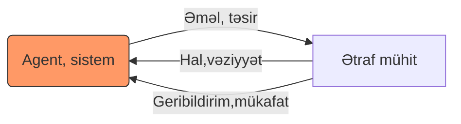

# Maşın öyrənməsinə aid qeydlər
[TOC]
## Maşın öyrənməsi haqqında ( Machine Learning  )
Ümumi ilkin baxış
* Təlimli öyrənmə (supervised learning)
* Yaxşılaşdırmaqla öyrənmə (reinforced learning)
* Təlimsiz öyrənmə (unsupervised learning)

### Təlimli öyrənmə 


---

  Bu öyrənmə növündə  nəticəsi bilinən və ya etiketlənmiş(sinfi bilinən) verilənləri istifadə etməklə naməlum verilənlərin aldığı nəticəni və ya aid olduğu sinfi aşkar etmək məqsədilə model öyrədilir. Məhz bu nəticəsi və etiketi məlum verilənlər əsasında model hazırlandığı üçün bu üsul təlimli(supervised) adlanır. ((Həmçinin bu hazır verilən-nəticələr kənardan rəhbər(müəllim-nəzarətçi) tərəfindən verildiyi üçün))
  
Xüsusiyyətlər:
 - İşarələnmiş verilənlər (Labeled data)
 - Birbaşa geribildirim (Direct feedback)
 - Nəticə-gələcəyin təhmini (Predict outcome future)

#### Təsnifat (Classification)

Təsnifat təlimli öyrənmə növüdür. Burada məqsəd əvvəlcədən sinfi bilinən verilənlər toplumunu istifadə etməklə naməlum verilənin  sinfini  təhmin edə biləcək modelin öyrədilməsidir.
 

#### Reqressiya  
Bu da təlimli öyrənmə növüdür. Həmçinin parametrik maşın öyrənməsi növünə də aid etmək olar.  Reqressiya analizində məqsəd müəyyən edici (asılı olmayan, prediktor, reqressor) verilənlərlə nəticələr (kriterial dəyişən) arasındakı asılılıqların modelinin qurulmasıdır. Hansı ki bu modeldən verilən əsasında nəticənin təhmin edilməsində istifadə edilə bilər. Qeyd edək ki, tapılan nəticə kəmiyyət (kəsilməz qiymət) olur və təsnifatlaşdırmadan fərqli olaraq sinif təyini xarakteri daşımır. 
$$
y \approx f(x,\beta)
$$
  
###  Yaxşılaşdırmaqla öyrənmə (reinforcement)


---

Bu öyrənmədə məqsəd ətraf mühitlə əlaqəli şəkildə özünü yaxşılaşdırmaq qabiliyyətinə malik sistem düzəltməkdir.
Təlimli öyrənməyə bənzəsə də  fərqli olaraq hazır dəqiq nəticələr ilə deyil, təsirin və ya verilənlər dəyişiminin geribildirim-mükafat funksiyası əsasında sistem qurulur. Nəticə etibarilə sistem ətraf mühitlə bu əks əlaqə funksiyası sayəsində bu mükafatı maksimumlaşdıran əməlləri  öyrənir. Hər bir hal-vəziyyət müsbət və ya mənfi olan geribildirim-mükafat ilə əlaqəlidir.


 
Xüsusiyyətlər:
 - Qəraralma əməliyyatı (Decision process)
 - Mükafat sistemi (Reward system)
 - Hərəkət-Əməl ardıcıllığının öyrənilməsi

### Təlimsiz öyrənmə 


---

Bu öyrənmənin tətbiqi isə heç bir təlim və ya əlaqə funksiyasız lazımlı və anlamlı informasiyanın çıxarılması məqsədini daşıyır.
Xüsusiyyətlər:
 - Xam verilənlər
 - Əks-əlaqə və geribildirimin olmaması
 - Verilənlərdən gizli quruluşun aşkar edilməsi 
 
#### Dəstələmə və ya Qruplaşdırma (Clustering)  
Dəstələmə və ya Qruplaşdırma verilənlər toplumundan naməlum oxşarlıq və göstəricilərə görə dəstələrin ayrılmasıdır. Bu bir növ naməlum kriteriyalara əsasən təlimsiz təsnifat(unsupervised classification) aparmaqdır. Bu metodu istifadə etməklə məlumatları strukturlaşdırmaq, əhəmiyyətli əlaqə və asılılıqları aşkar etmək mümkündür.

#### Fəza ölçüsünün azaladılması (Dimensionality reduction for data compression)
Təlimsiz öyrənmənin başqa bir alt sahəsi kimi `fəza ölçüsününazaldılması`-ı göstərə bilərik. Bu modeli tətbiq etməkdə məqsəd xüsusiyyətlər çoxluğunu azaltmaqdır. hansı ki bununla biz məlumatlarda olan artıq-lazımsız hissələri kənarlaşdıra, verilənləri daha sadə anlamlı emal edilə bilən hala sala bilərik. Bu da təbii ki həm də sürətə həm də yaddaşa müsbət təsir edəcək. Qeyd edilən üsuldan həmçinin çoxölçülü fəzanı təsvir edilən fəzaya gətirmək üçün də istifadə edilir.


### Xüsusiyyətlər-Əlamətlər vektoru (Feature vectors)
---
Hər hansı bir real əşyanı biz müəyyən əlamətlərlə əks etdirə bilərik. Məsələn maşın dedikdə və ya aldıqda aşağıdakı özəlliklər ağıla gəlir:


Ümumən əşyanın  özəllikləri rəqəmlər halında vektor şəklində əks etdirilir. Süsən çiçəyi nümunəsində:


Yuxarıdakı süsən çiçəyi toplumuna aid verilənləri matriks şəklində ($X$) əks etdirmək olar. Bu zaman sütunlar əlamətlərə  sətirlər isə nümunələrə uyğun gələcək. Əgər fikir versəniz görmək olar ki bu misalda hər sətirdəki son sütun hədəf-nəticə verilənləri (sinif etiketləri)-dir. Onun özünü ayrıca sütun vektoru şəklində əks etdirə bilərik.
$$  X= \begin{pmatrix}x_1^{(1)} & x_2^{(1)} & x_3^{(1)} & x_4^{(1)} \\ x_1^{(2)} & x_2^{(2)} & x_3^{(2)} & x_4^{(2)} \\ x_1^{(3)} & x_2^{(3)} & x_3^{(3)} & x_4^{(3)} \\
\vdots &\vdots&\vdots &\vdots
\\
x_1^{(150)} & x_2^{(150)} & x_3^{(150)} & x_4^{(150)} 
\end{pmatrix}
$$
$i$-ci çiçək nümunəsində olan bütün əlamətlərdən ibarət vektor:
$${\mathbf x^{(i)}}= \begin{pmatrix}x_1^{(i)} & x_2^{(i)} & x_3^{(i)} & x_4^{(i)}  
\end{pmatrix}
$$
$j$-ci əlamətə uyğun bütün nümunələrdən ibarət vektor:
$$
 \mathbf x_j=\begin{pmatrix} x_j^{(1)}  \\ x_j^{(2)}  \\ x_j^{(3)}  \\
\vdots 
\\
x^{(150)} 
\end{pmatrix}
$$
Bütün nümunələr üçün hədəf dəyişənlər və ya Sinif etiketlərindən ibarət vektor:  
$$
 \mathbf y=\begin{pmatrix} y^{(1)}  \\ y^{(2)}  \\ y^{(3)}  \\
\vdots 
\\
y^{(150)} 
\end{pmatrix} ( y \in \{Setosa, Versicolor, Virginica\} )
$$

$X$ matriksini alternativ olaraq belə də yazmaq olar (Qeyd burada $\mathbf x^{(i)}$ nümunə sətir vektorları və $\mathbf x_j$ əlamət sütun vektorları ilə göstərilir} :
$$  X= \begin{pmatrix} {\mathbf x ^{(1)}}^T  \\ \hline  \mathbf x ^{(2)^T}   \\ \hline {\mathbf x ^{(3)}}   \\ \hline 
\vdots  
\\ \hline 
{\mathbf x ^{(150)}}^T
\end{pmatrix} = \left( \begin{array}{c|c|c|c}   \mathbf x_1  & \mathbf x_2  & \mathbf x_3  & \mathbf x_4  \end{array} \right )
$$
:::danger
$\mathbf {vektor}^T$ yazılışını matriks-vektor formullarında  yekun vektorun sətir vektor şəklində nəzərdə tutduğumuzu göstərmək üçün istifadə edəcəyik. Əksa halda verilən vektor sütun vektorudur.
$\mathbf {MATRIKS}^T$ burda isə əsl mənasında $\mathbf {MATRIKS}$-in çevrilmiş (transpose) kimi nəzərdə tutulur. 
:::
### Maşın öyrənmə sistemlərinin hazırlanması


---

Ümumən M.Ö sistemlərinin hazırlanmasını aşağıdakı sxem və mərhələrlə əks etdirmək olar:

* verilənlərin ilkin emalı (preprocessing)
* öyrənmə (learning)
* qiymətləndirmə (evaluation)
* təhmin etmə (prediction)


#### Verilənlərin ilkin emalı (preprocessing)

Yuxarıdakı sxemlərdən göründüyü kimi xam verilənlər çox vaxt birbaşa model öyrənməsində istifadə edilmir. Məhz bu səbəbdən verilənlərin ilkin emalı mühüm əhəmiyyət kəsb edir. Bu mərhələdə xüsusiyyətlər vektoru çıxarılır. Bir çox M.Ö alqoritmlərində bu xüsusiyyətlər eyni ölçü və miqyasda ( [0, 1] aralığı ve ya 0 orta vahid variasiyalı standard normal paylama) olur. Bundan əlavə xüsusiyyəltər arasında asılılıqlar (korrelyasiya) olduğundan bu mərhələdə həmçinin **Fəza ölçüsünün azaladılması** da tətbiq edilir. Həmçinin bu bir çox hallarda sürət və yaddaşda irəlliləyişə həm də lazımsız məlumatlardan azad olmağa imkan verir. Bu mərhələdə biz verilənlərin bir qismini test üçün də ayırırıq. Test verilənlərindən modeli qiymətləndirmək üçün istifadə edilir.
* Xüsusiyyətlərin çıxarılması və miqyaslanması
* Xüsusiyyətlərin seçilməsi
* Fəza ölçüsünün azaladılması

#### Öyrənmə prosesi və öyrənmə alqoritmi
Məlum məsələdir ki eyni model fərqli fərqli məsələlərdə fərqli nəticələr verəcək. Bu səbəbdən öyrənmə alqoritminin seçilməsi və öyrədilməsi əsas mərhələlərdən biridir. Modellərin özlərini müqayisə etdikdə bir çox metrikalardan istifadə edilir( model növlərindən və məsələdən asılı olaraq orta xəta, təsnifatlaşdırma dəqiqliyi, həsasslıq(precision) və s). Qeyd edək ki bunu həyata keçirmək üçün öyrənməyə ayrılmış verilənlərin özündən də əlavə olaraq təsdiq-yoxlama üçün verilənlər (validation data) ayırırıq(bu test üçün ayrılmış data deyil). Onu da qeyd edək ki bu mərhələdə modellərin parametrləri də yaxşılaşdırılır. (hyperparameter optimization)
* Modelin seçilməsi
* Çarpaz yoxlama (Cross validation)
* Performans metrikaları
* Hiperparametrlərin yaxşılaşdırılması

#### Modelin qiymətləndirilməsi və təxminetmədə istifadəsi 

Model son olaraq test verilənləri üzərindən qiymtələndirilir. Əgər model qane edirsə ondan ümumi hallarda təhmin etmə üçün istifade edə bilərik. Qeyd edək ki, öyrənmə verilənləri üzərində ilkin emalda istifadə etdiklərimizi ümumən bu mərhələdəki verilənlər üzərində də tətbiq edirik.

## Xətti ikili təsnifat.

### Perseptron
---
Bu modellə (birqatlı klassik perseptron) ikili təsnifləşdirmə aparmaq mümkündür(yəni iki sinif arasında seçim etmək. çiçəkdi yoxsa çiçək deyil, yaşlıdı yoxsa cavandı və s). Perseptron modeli ilk vaxtlar beyin neyronlarının sadə iş prinsipinə bənzədilmişdir. (təbii ki həqiqətdə neyronların necə işlədiyi tam aydın deyil)
Sxematik olaraq perseptron aşağıdakı kimi göstərilə bilər:


Qeyd edək ki bu tip model yalnız xətti ayrıla biləcək təsnifat üçün yarayır, çünki təyin edəcəyimiz qərar funskiyası giriş verilənlərini yalnız xətlə (yüksək ölçülərdə isə hipermüstəvi) ayırmaq imkanına malikdir  
  
   

 Riyazi olaraq necə təyin edildiyinə baxaq:  

Qərar funskiyası $\phi(z)$ $\mathbf x$ giriş verilənləri və $\mathbf w$ çəki əmsallarının xətti kombinasiyası ($z = w_1x_1 + w_2x_2 + \cdots + w_mx_m$) ilə təyin edilir və vahid addım funksiyasıdır (unit step function).
$$
\phi(z)=\begin{cases}
1  & \text{əgər $z >= \theta$  } \\
-1 & \text{əks halda  } 
\end{cases}
$$  
Burada:
$\theta$ - qərar qəbulunda istifadə edəcəyimiz səviyyə  ölçüsüdür   
<br/>       
Yuxarıdakı təyindən göründüyü kimi $\mathbf x^{(i)}$ giriş arqumentləri üçün funksiyanın  qiyməti 1 və yaxud -1 olacaq. (Qeyd $\phi(z)$ yazılışında arqument  $x^{(i)}$ vektorudu. )
Sadəlik üçün $\theta$-ı $w_0=-\theta$ və $x_0=1$ əvəzləyib funksiyanı aşağıdakı kimi də əks etdirə bilərik (funskiyada sol tərəfə keçirməklə).
$$
z = w_0x_0(b)+w_1x_1 + w_2x_2 + \cdots + w_mx_m= \mathbf w^T\mathbf x  
$$$$
\phi(z)=\begin{cases}
1  & \text{əgər $z >= 0$  } \\
-1 & \text{əks halda  } 
\end{cases}
$$
 MÖ-də $w_0=-\theta$ meylilik (bias) adlandırılır və model öyrədildikdən sonra çəkilərdən fərqli olaraq  girişlə əlaqəli olmur (yəni $x_0=1$). Meylilik (bias) $b$ ilə işarə edilir.
#### Perseptron-un öyrənilməsi

Perseptron öyrənilməsi qaydasını bu cür sxemlə təsvir edə bilərik


Perseptron öyrəniləməsinin alqoritmi:
1. Əvvəlcə çəkiləri təsadüfi kiçik ədədlərə bərabər götürürük. (0 -a bərabər etməmənin səbəbləri var)
2. Hər dövrdə (k sayda dövr və ya arzuolunan səviyyə) 
   - Hər $\mathbf x^{(i)}$ nümunəsi üçün:
a.     $\hat{y}^{(i)}$ nəticəsi perseptron qərar funksiyası ilə hesablanır $\phi(\mathbf x^{(i)})$
b.     Çəkiləri aşağıdakı funksiya ilə yeniləyirik:
$$
w_j:= w_j + \Delta w_j   \\ 
\Delta w_j= \eta (y^{(i)}-\hat{y}^{(i)})x_j^{(i)} $$
Burada:  
$\eta$ -  öyrənmə tezliyi adətən $0<\eta<1$  
$()^{(i)}$ - $i$-ci nümunə 
$y^{(i)}$ - əsl gözlənilən qiymət 
$\hat{y}^{(i)}$ - təhmin edilən qiymət 
$x_j^{(i)}$ - giriş verilənin $j$-ci əlaməti  
Əgər $w_0$ (bias) meyldirsə $x_0^{(i)}$-ı 1 götürürük 
$\Delta w_j$ - $j$-ci çəki dəyişimi 

2-ci addım əvvəlcədən təyin edilmiş k sayda verilənlər üzərində öyrənmə dövrlərindən (epoch) və ya iterasiyalardan sonra dayandırıla bilər. Belə ki bəzən verilənlər tam xətti ayrılan olmur. Ya da  iterasiya xətası arzuolunan səviyyəyə çatana qədər öyrədilə bilər (Sadə yolla bir dövrdə (epoch) orta xəta):
$$ 
\frac 1s\sum_i^s|y^{(i)}-\hat{y}^{(i)}| < \gamma
$$
$\gamma$  arzulolunan səviyyə 
$s$   bir dövrdə nümunələr sayı 
 

Sadə halda python kodla baxaq:
 Biz numpy paketindən istifadə edəcəyik və dayanma nöqtəsi kimi dövlər sayı əsas götürüləcək.
```python3
# -*- coding: utf-8 -*-
import numpy as np

class Perceptron(object):
    """Perceptron təsnifatı.

    Parametrlər
    ------------
    eta : {float} Öyrənmə tezliyi ( 0.0:1.0) aralığı
    n_iter : {int} Təlim verilənlərindən istifadə dövrlərin sayı(epoch).
    random_state : {int} Təsadüfi ədəd generatoru üçün fərqlilik qiyməti. 

  
    -----------
    w_ : Cari Çəkilər .
    errors_ : {list} siyahıda hər dövr üçün 
              xətalar sayı saxlanılacaq.

    """
    def __init__(self, eta=0.01, n_iter=50, random_state=1):
        self.eta = eta
        self.n_iter = n_iter
        self.random_state = random_state

    def fit(self, X, y):
        """Öyrənmə verilənlərinə uyğunlaşdırma.

        arqumentlər
        ----------
        X : {array}, ölçü = [n_nümunə, n_xüsusiyyət] 
        y : array, ölçü = [n_nümunə]
          Target values.

        Qaytarılan
        -------
        self : object

        """
        rgen = np.random.RandomState(self.random_state)
        self.w_ = rgen.normal(loc=0.0, scale=0.01, size=1 + X.shape[1])
        self.errors_ = [] 
        for _ in range(self.n_iter):
            errors = 0
            #zip funksiyasi ilə X,y elementlərini cütlər 
            #şəklində iterasiya edirik
            for xi, target in zip(X, y):
                update = self.eta * (target - self.predict(xi))
                self.w_[1:] += update * xi
                self.w_[0] += update #bias-da x0=1-di
                errors += int(update != 0.0)
            self.errors_.append(errors)
        return self
        
    def net_input(self,X):
        """Cəm ( çəki * verilənlər)
           w_[0]-da bizim bias-di
        """
        return np.dot(X,  self.w_[1:]) +  self.w_[0]

    def predict(self,X):
        """X veriləni üçün sinif təhmini"""
        return np.where(self.net_input(X) >= 0.0, 1, -1)
        
```

Koda fikir versək biz dövr sayından əlavə xətaların baş vermə sayını listə əlavə edirik. Qeyd edək ki xətti (hipermüstəvi) ayrıla bilən verilənlərdə bu say 0-a yaxınlaşaraq optimallaşacaq. Ümumi halda isə yuxarıdakı (3-cü addımdakı düstur) orta xəta ilə də bunu izləmək olar.

### OVA (OVR) Birin digərlərinə qarşı (BDQ)
Perseptron vasitəsilə ancaq ikili təsnifat aparmaq mümkün olsa da onu çoxsinifli təsnifata gətirmək olar. Bunun üçün birin digərlərinə qarşı (BDQ) (One-versus-Rest|all) üsulundan istifadə edə bilərik. Bu üsulda biz hər bir sinif üçün təsnifatlaşdırma modeli öyrətməliyik. Hansı ki həmin sinif üçün öyrətdiyimiz modeldə özü əsas-müsbət kimi , digər siniflər toplumu  isə mənfi hal kimi götürülür. əgər biz n sayda sinif təyini aparmaq istəyiriksə onda n sayda təsnifatlaşdırma modeli qurmalıyıq. Təhminetmə zamanı ən yaxşı nəticə alan modelin əsas sinfi axtardığımız sinif olacaq. Perseptronda isə təhmin edilən sinif təsnifatlaşdırma modelləri arasında $z=\mathbf w^T \mathbf x$ xətti kombinasiyasının ədədcə böyük qiymət aldığı modelin əsas  sinfi götürülə bilər. Fikir versəniz biz təhminetmə zamanı modellərarası müqayisə apara bilək deyə qərar funksiyasının özünü yox orda istifadə edilə $z$ kəmiyyətini istifadə edirik. (bu kəmiyyətə BDQ-də etibarlılıq qiyməti deyilir)


### Uyğunlaşabilən xətti neyron  (Adaline)


ADALINE alqoritmlə Perseptron arasında əsas fərq odur ki əmsallar xətti aktivasiya funksiyası əsasında yenilənir. Perceptronda isə addım metodu ilə yenilənirdi. Sadə halda xətti aktivasiya kimi elə eynilik funksiyasını ($I(x)=x$) götürə bilərik.

$$
\text{eynilik aktivasiya funksiyas $\mathbf \phi(z)$: }   \\
\mathbf \phi(z)=I(z)=\mathbf  w^T \mathbf x = \mathbf  x^T \mathbf w
$$

#### Adaline-ın öyrənilməsi
Perseptronla müqayisəli sxemi: 


   Şəkildən də göründüyü kimi Adaline doğru nəticələri xətti aktivasiya funksiyasının kəsilməz dəyərləri ilə müqayisə edir, model xətasını hesablayır və əmsalları yeniləyir. Xatırladaq ki Perseptron-da bu çıxış nəticələri ilə müqayisə edilirdi.    
   Təlimli öyrənmənin əsas tərkib hissələrindən  biri də öyrənmə prosesində Zərər funksiyasının optimallaşdırılmasıdır. Adaline üçün  Zərər $J$  funksiyasını xətaların kvadrat cəmi kimi təyin edə bilərik. 
   


$$
  J(\mathbf w) =\frac 12\sum_i( y^{(i)}-\phi({z}^{(i)}))^2
$$
:::warning
<span style="color:red">Funksiyadakı $\frac 12$  kəsri törəmədən alınan nəticənin sadə olması üçündür.</span>
:::


Çəkilərin effektiv olması üçün bu Zərər funksiyası optimallaşdırılmalıdır (minimallaşdırılmalıdır). Perseptron-un addım funksiyasından fərqli olaraq aktivasiya funksiyası bizə zərər funksiyasını differensiallamağa imkan verir. Optimallaşdırma üsulu kimi Qradient enişi (Gradient descent) metodundan  istifadə edə bilərik (Zərər funksiyamız şəkildəki kimi qabarıqdır (convex) və minimuma malikdir):
  $$
       \Delta \mathbf w = - \eta \nabla J(\mathbf w)
  $$
  


:::info
Lokal minimum axtarıldıqda Qradientin əksinə yəni $-\eta \nabla J(\mathbf w)$ hissəsi istiqamətində hərəkət edilir. Və bu proses Qradient enişi adlanır.
Qradient özü $\nabla f$ ilə və ya $grad f$ işarə edilir və aşağıdakı formula şəklində əks etdirə bilərik: (xüsusi törəmələr vektoru)
$$
\nabla f = \begin{pmatrix} \frac{\partial f}{\partial x_0}  \\ \frac{\partial f}{\partial x_1} \\ \vdots \\ \frac{\partial f}{\partial x_{k-1}} \end{pmatrix}  
$$
:::
$\nabla J(\mathbf w)$-i yəni $J$ zərər funksiyasının hər $w_j$ çəkisinə olan xüsusi törəməsini hesablayaq:

$$
  \frac{\partial J}{\partial  w_{j}} , j=0,1,..,m  \\
\frac{\partial J}{\partial  w_{j}}  =-\sum_i( y^{(i)}-\phi({z}^{(i)}))x^{(i)}_{j}
$$

$$
\Delta  w_{j}   =- \eta\frac{\partial J}{\partial   w_{j}} = \eta \sum_i( y^{(i)}-\phi({z}^{(i)}))x^{(i)}_{j} 
$$

$$
\mathbf w := \mathbf w+ \Delta \mathbf w
$$

Zərər funksiyasınn xüsusi törəməsinin alınması:
::: info
$$
\forall j = 0,..,m \text{ üçün} \\
\frac{\partial J}{\partial  w_{j}}=    \frac{\partial}{\partial  w_{j}} \frac{1}{2}\sum_i( y^{(i)}-\phi({z}^{(i)}))^{2}  $$$$= \frac{1}{2}\frac{\partial}{\partial  w_{j}}\sum_i( y^{(i)}-\phi({z}^{(i)}))^{2} $$$$ = \frac{1}{2} \sum_i2(y^{(i)}-\phi({z}^{(i)}))\frac{\partial}{\partial  w_{j}}(y^{(i)}-\phi({z}^{(i)}))$$$$=\sum_i(y^{(i)}-\phi({z}^{(i)}))\frac{\partial}{\partial  w_{j}}(y^{(i)}-\sum_i( w_{j} x_{j}^{(i)}))$$$$=\sum_i(y^{(i)}-\phi(z^{(i)}))(-x_{j}^{(i)})$$$$=-\sum_i(y^{(i)}-\phi(z^{(i)}))x_{j}^{(i)}
$$
:::

Adaline öyrənilməsinin Perseptron öyrənilməsindən fərqli cəhətləri aşağıdakılardır:
* $\phi(\mathbf  z^{(i)})$  aktivasiya funksiyasından çıxan həqiqi ədəddi, perseptron-da isə bu qərar funksiyasından çıxan son nəticə olan sinif göstəricisidir
* Çəkilərin yenilənməsi bütün təlim verilənləri əsasında hesablanır ($\mathbf w := \mathbf w+ \Delta \mathbf w$) hansı ki buna Toplu üsulla qradient enişi  deyilir (Batch GD). Perseptron-da isə bu hər nümunə əsasında yenilənir. (Qeyd Çəkilərin iterativ yolla yenilənməsi də mümkündür. Stoxastik (SGD))
#### Analitik üsulla  minimumun tapılması
Analitik üsulla məsələni həll etmək üçün xüsusi törəmələrin 0-a (Qeyd: lokal minimum və ya maksimumlarda törəmə 0-a bərabərdi) bərabər olan halı üçün çəkiləri tapmaq lazımdı.
$$
\frac{\partial J}{\partial  w_{j}}=0 \space\space \forall j = 0,1,...,m \\
\forall j = 0,..,m \text{ üçün} \\
\frac12\sum_i(y^{(i)}-\phi(z^{(i)}))x_{j}^{(i)} = 0  \\
\sum_iy^{(i)}x_{j}^{(i)} - \sum_i\phi(z^{(i)})x_{j}^{(i)}=0 \\
\sum_iy^{(i)}x_{j}^{(i)}=\sum_i\phi(z^{(i)})x_{j}^{(i)} \space \space  \\
\sum_iy^{(i)}x_{j}^{(i)}=\sum_i\sum_{l=0}^mw_lx_l^{(i)}x_{j}^{(i)}
$$
Yuxarıdakı  sistem tənlyi həlli olan $w_l$ çəkiləri axtarılan optimal çəkilər olacaq. Həlli tam vermək üçün zərər funksiyasını və onun törəməsini matriks-vektorlarla əks etdirib tənliyin həllini verək (Burda eynilik funsiyası birbaşa əvəzlənib):
$$
\begin{align}
J(\mathbf w) &=\frac 1{2n} (\mathbf y-X\mathbf w)^T(\mathbf y-X\mathbf w)\\ 
&=\frac 1{2n} (\mathbf y^T-(X\mathbf w)^T) (\mathbf y-X\mathbf w) \\
&=\frac 1{2n} (\mathbf y^T\mathbf y-(X\mathbf w)^T\mathbf y-\mathbf y^T(X\mathbf w)+(X\mathbf w)^TX\mathbf w) \\
&=\frac 1{2n} (\mathbf y^T\mathbf y -2(X\mathbf w)^T\mathbf y + \mathbf w^TX^TX\mathbf w)
\end{align}
$$
Zərər funksiyasının törəməsini 0-a bərabər ediyimiz üçün $\frac1{2n}$ əmsalını nəzərə almasaq da olar
$$
\frac{\partial J}{\partial \mathbf w}=2X^TX\mathbf w-2X^{T}y=0 \\
X^TX\mathbf w = X^{T}\mathbf y
$$
Həllimiz isə :  
$$
\mathbf w=(X^TX)^{-1}X^T \mathbf y
$$
Göründüyü kimi analitik yolla həll matriksin inversiyasının olmasından əlavə həm də çoxlu hesablamalar tələb edir. Bu səbəbdən əlverişli sayılmır.


#### Toplu (Batch) Qradient enişi  TQE (matriks vektorla)
İlk öncə Toplu qradient enişini riyazi matriks və vektorlarla əks etdirək
$$
\Delta  w_{j}   =- \eta\frac{\partial J}{\partial \mathbf w_{i}} = \eta \sum_i( y^{(i)}-\phi({z}^{(i)}))x^{(i)}_{j}
$$
Sadəlik üçün $error^{(i)}=y^{(i)}-\phi({z}^{(i)})$ ilə əvəzləsək onda belə yazmaq olar   
$$
\begin{align}
\Delta  w_{j}   &=\eta \sum_ierror^{(i)}x^{(i)}_{j} \\&= \eta \space \mathbf  x_{j}^T \mathbf {error}
\end{align}
$$
$x_{j}^T$ - $j$-ci əlamətin (xüsusiyyətin) nümunələrindən ibarət sətir vektorudur. ( başqa cür desək sütunun çevrilmiş (Transpose) forması):
$$ 
\mathbf x_j^T={\begin{pmatrix} x_j^{(1)} \\ x_j^{(2)}    \\ x_j^{(3)}  \\
\vdots 
\\
x_j^{(n)} 
\end{pmatrix}}^T = \begin{pmatrix} x_j^{(1)} &  x_j^{(2)} & x_j^{(3)} &
\cdots 
&
x_j^{(n)} 
\end{pmatrix}
$$
$\mathbf {error}$   sütun vektorudu:
$$
\mathbf {error} = \begin{pmatrix} error^{(1)}   \\ error^{(2)}  \\
\vdots 
\\
error^{(n)}\end{pmatrix}
$$

Həmçinin bizim aktivasiya funksiyamızın eynilik funksiyası olduğunu nəzərə alsaq nümunələrin $\mathbf {error}$ sütun vektorunu bu cür də təsvir edə bilərik:
$$
 y^{(i)}-\phi({z}^{(i)})= y^{(i)}-{z}^{(i)} \\
{z}^{(i)} = {\mathbf  x^{(i)} }^T\mathbf w \\
 \mathbf {z} = \begin{pmatrix} z^{(1)}   \\ z^{(2)}  \\
\vdots 
\\
z^{(n)}\end{pmatrix} = \begin{pmatrix} {\mathbf x ^{(1)}}^T  \\ \hline  \mathbf x ^{(2)^T}   \\ \hline 
\vdots  
\\ \hline 
{\mathbf x ^{(n)}}^T
\end{pmatrix} \space \mathbf w  \\  \mathbf z= \mathbf X \mathbf w \\
\mathbf {error}= \mathbf  y - \mathbf X \mathbf w
$$


Nəzərə alsaq ki bir nümunədə m sayda xüsusiyyət var (0-cı burada meyillik girişi olduğu üçün 1 -ə bərabərdir. Onunla birgə m+1 sayda olur)
$$\mathbf x^{(i)}= \begin{pmatrix}  (x_0^{(i)}=1) & x_1^{(i)} & x_2^{(i)} & x_3^{(i)} & \cdots &   x_m^{(i)}  
\end{pmatrix}
$$
onda $\Delta  w_{j}  =\eta \space \mathbf  x_{j}^T \mathbf {error}$-i bütün əlamətlər üçün belə yaza  bilərik:
$$
\begin{align}
\Delta \mathbf w =  \begin{pmatrix} w_{0} \\ w_{1}   \\ w_{2}  \\
\vdots 
\\
w_{m}\end{pmatrix} &= \eta \space \begin{pmatrix} \mathbf x_0^T \\ \hline  \mathbf x_1^T   \\ \hline \mathbf x_2^T   \\ \hline 
\vdots  
\\ \hline 
\mathbf x_m^T 
\end{pmatrix}  \mathbf {error} \\ &= \eta \space { \left( \begin{array}{c|c|c|c|c}   \mathbf x_0  & \mathbf x_1  & \mathbf x_2  & \cdots & \mathbf x_m  \end{array} \right )}^T \mathbf {error} \\ &= \eta \space \mathbf X^T \mathbf {error}
\end{align}
$$
Burada $\mathbf X^T$ bütün toplumun $\mathbf X$ giriş matriksinin çevrilmişi (transpose) olacaq.

#### TQE alqoritmi python kodla
Əsas alqoritm:
- Hər dövr üçün (k sayda dövr (epoch) və ya arzuolunan səviyyə)
    - Hər $j$-ci xüsusiyyət üçün:
$$
\Delta  w_{j}   =- \eta\frac{\partial J}{\partial   w_{j}} = \eta \sum_i( y^{(i)}-\phi({z}^{(i)}))x^{(i)}_{j} 
 \\
 w_{j} := w_{j}+ \Delta  w_{j}
$$
    - və ya birdəfəlik yığcam matriks-vektor formasında (eynilik funksiyası nəzərə alınıb) :
$$
\mathbf {error}= \mathbf  y - \mathbf X \mathbf w
\\
\Delta \mathbf w = \eta \space \mathbf X^T \mathbf {error} 
\\
\mathbf w := \mathbf w+ \Delta \mathbf w
$$


Arzuolunan səviyyə (meyar) ilə müqayisə etmək üçün xətaların kvadratları cəminin yarısını götürmək olar:
$$
\frac 12\sum_i^s(y^{(i)}-\hat{y}^{(i)})^2 < \gamma 
$$

$\gamma$  arzulolunan səviyyə 
$s$   bir dövrdə nümunələr sayı 
 

```python3
class AdalineGD(object):
    """Adaline BGD
    ( Xətti uyğunlaşan neyron təsnifatı TQE ilə ).

    Parametrlər
    ------------
    eta : {float} Öyrənmə tezliyi ( 0.0:1.0) aralığı
    n_iter : {int} Təlim verilənlərindən istifadə dövrlərin sayı(epoch).
    random_state : {int} Təsadüfi ədəd generatoru üçün fərqlilik qiyməti. 

  
    -----------
    w_ : Cari Çəkilər .
    cost_ : {list} siyahıda hər dövr (epoch) üçün
            xətaların kvadratı cəmi saxlanılacaq

    """
    def __init__(self, eta=0.01, n_iter=50, random_state=1):
        self.eta = eta
        self.n_iter = n_iter
        self.random_state = random_state

    def fit(self, X, y):
        """Öyrənmə verilənlərinə uyğunlaşdırma.

        arqumentlər
        ----------
        X : {array}, ölçü = [n_nümunə, n_xüsusiyyət] 
        y : array, ölçü = [n_nümunə]
          Target values.

        Qaytarılan
        -------
        self : object

        """  
        rgen = np.random.RandomState(self.random_state)
        self.w_ = rgen.normal(loc=0.0, scale=0.01, size=1 + X.shape[1])
        self.cost_ = []

        for i in range(self.n_iter):
            net_input = self.net_input(X)
            output = self.activation(net_input)
            errors = (y - output)
            self.w_[1:] += self.eta * X.T.dot(errors)
            self.w_[0] += self.eta * errors.sum()
            cost = (errors**2).sum() / 2.0
            self.cost_.append(cost)
        return self
 
    def net_input(self,X):
        """Cəm ( çəki * verilənlər)
           w_[0]-da bizim bias-di
        """
        return np.dot(X,  self.w_[1:]) +  self.w_[0]

    def activation(self, X):
        """Xətti aktivasiya. 
        Eynilik funksiyası elə arqumenti qaytarır"""
        return X

    def predict(self,X):
        """X veriləni üçün sinif təhmini"""
        return np.where(self.activation(self.net_input(X)) >= 0.0, 1, -1)


```

#### Qradient enişinə öyrənmə tezliyinin ($\eta$) təsiri 


#### Xüsusiyyət kəmiyyətlərini miqyaslamaqla Qradient enişinin yaxşılaşdırılması

Bir çox maşın öyrənmə alqoritmləri optimal performans göstərməsi üçün xüsusiyyət kəmiyyətlərinin miqyaslanmasını tələb edir. Qradient eniş alqoritmi miqyaslanmadan çox bəhrələnən bir alqoritmdir. Biz miqyaslanma üçün standartlaşdırma metodundan istifadə edəcəyik. Standardartlaşdırma giriş verilənlərinə normal paylanma xüsusiyyəti verir. Bu metod qradient enişin tez bir zamanda minimum nöqtəsinə çatmasına imkan verir. Standartlaşdırma üçün düstur: 
$$
\mathbf x_j^{'}=\frac{\mathbf x_j-\mu _j}{\sigma _j}
$$
Standartlaşdırmadan istifadə olunmasının digər bir səbəbi isə aşağıdakı şəkildən göründüyü kimi alqoritmin daha az mərhələdən keçərək optimal nəticəni əldə etməsidir. 


#### Stoxastik Qradient enişi
Yada salaq ki, Toplu Qradient enişində biz qradienti bütün öyrənmə nümunələr üzərində hesablayırıq. Bu isə o dmeəkdir ki böyük həcmli verilənlərdə bir addım eniş etmək üçün iri hesablamalar aparılacaq. Nəticədə çəkilər gec yenilənəcək və qlobal minimuma çatma prosesi xeyli vaxt alacaq. Stoxastik Qradient enişində isə biz çəkiləri hər nümunə sırasında yeniləyəcəyik.

$$
\Delta  w_{j}   =  \eta \space (y^{(i)}-\phi({z}^{(i)}))x^{(i)}_{j}
$$

Məhz bu səbəbdən bu alqoritm iterativ adlanır. SQE həmçinin  onlayn (on-line) (onlayn -yəni verilənlərin işlənməsi emalı ilə eyni zamanda baş verir ) üsulla da öyrətmək olar. Bu zaman biz verilənlər gəldikcə onu öyrətmədə istifadə edirik.
Qeyd edək ki, nümunə üzərində qradient toplu üzərində qradientin  təqribi və küylü göstəricisi olacaq. Məhz bu stoxastik xasiyyətinə görə qlobal minimuma doğru yol (2-ölçülü fəzada-müstəvidə) birbaşa yox ziqzaqvaridir hansı ki bu da öz növbəsində dar lokal minimumları atlamağa imkan verir. SQE-də çəki yenilənmələrinin daha tez-tez hər nümunədə yenilənməsi qlobal minimuma yaxınlaşma prosesisini daha da sürətləndirir. Təsdiq edilmişdir ki, SQE  optimallaşdırılan funksiya qabarıq və psevdo-qabarıq (convex) olduqda qlobal minimuma həmişə yaxınlaşır.

Bundan əlavə, SQE-i əlavə üsullarla da yaxşılaşdırmaq olar:
- Zamanla öyrənmə tezliyini dəyişmək yolları ilə:
$$
a)\space \eta(t) =\frac{c_1}{t+c_2}  \\
b)\space \eta(t+1) = \frac{\eta(t)}{1+td}  
$$
$c_1,c_2,d$ sabit ədəd $t$- iterasiya sayı
- Əvvəlki çəki dəyişminin hissəsini yeni çəki dəyişiminə əlavə etməklə daha sürətli yenilənmələrə nail olmaq :
$$
\Delta \mathbf{w}_{t+1} := \eta \nabla J(\mathbf{w}_{t+1}) + \alpha \Delta {w}_{t}
$$

SQE-də hər dövrdə daha dolğun nəticə almaq və tsikllardan (təkrarlanan yenilənmələrdən) qaçmaq üçün giriş verilənləri üzərində təsadüfi yerdəyişmələr edirik. Yerdəyişmələri bir neçə üsulla edə bilərik:
a)  Giriş verilənləri üzərində öyrənmə başlamazdan əvvəl bir dəfə təsadüfi yerdəyişmələr aparılır.
b)  Hər bir dövr üçün (epoch) öyrənmə verilənləri üzərində təsadüfi yerdəyişmələr aparılır və sonra çəki yenilənmələri həmin yerdəyişmiş nümunələr üzərində olur.
c)  Hər nümunə üçün təsadüfi olaraq (sonra yerinə qaytarmaqla) öyrənmə verilənlərindən götürülüb çəki yenilənməsi  aparılır. 

#### SQE alqoritmi (python kodla)  
Əsas alqoritm:
- Hər dövr üçün (k sayda dövr (epoch) və ya arzuolunan səviyyə)
  - İstəyə görə nümunələr toplumu üzərində təsadüfi yerdəyişmə apar
  - Hər $\mathbf x^{(i)}$ nümunəsi üçün:
    - Hər $j$-ci xüsusiyyət üçün:
    $$
    \Delta  w_{j}   =  \eta \space (y^{(i)}-\phi({z}^{(i)}))x^{(i)}_{j}
   $$
    - və ya birdəfəlik yığcam vektor formasında:
    $$
        \Delta \mathbf  w    =  \eta \space (y^{(i)}-\phi({z}^{(i)}))\mathbf x^{(i)} 
    $$


Arzuolunan səviyyə (meyar) ilə müqayisə etmək üçün xətaların kvadratları cəminin orta-ı götürmək olar:
$$
\frac 1{2s}\sum_i^s(y^{(i)}-\hat{y}^{(i)})^2 < \gamma  
$$
$\gamma$  arzulolunan səviyyə  
$s$   bir dövrdə nümunələr sayı 
Python dili:
```python3
class AdalineSGD(object):
    """Adaline SGD
    ( Xətti uyğunlaşan neyron təsnifatı Stoxastik Qradient enişi).

    Parametrlər
    ------------
    eta : {float} Öyrənmə tezliyi ( 0.0:1.0) aralığı
    n_iter : {int} Təlim verilənlərindən istifadə dövrlərin sayı(epoch).
    shuffle : {bool (default: True)} Tsiklların qarşısını almaq məqsədilə .
              öyrənmə verilənlərinin qarışdırılması seçimi.
    random_state : {int} Təsadüfi ədəd generatoru üçün fərqlilik qiyməti. 

  
    -----------
    w_ : Cari Çəkilər .
    cost_ : {list} siyahıda hər dövr (epoch) 
            üçün xətaların kvadratı cəminin ortası saxlanılacaq

    """    

    def __init__(self, eta=0.01, n_iter=10, shuffle=True, random_state=None):
        self.eta = eta
        self.n_iter = n_iter
        self.w_initialized = False
        self.shuffle = shuffle
        self.random_state = random_state
        
    def fit(self, X, y):
        """Öyrənmə verilənlərinə uyğunlaşdırma.

        arqumentlər
        ----------
        X : {array}, ölçü = [n_nümunə, n_xüsusiyyət] 
        y : array, ölçü = [n_nümunə]
          Target values.

        Qaytarılan
        -------
        self : object

        """  
        self._initialize_weights(X.shape[1])
        self.cost_ = []
        for i in range(self.n_iter):
            if self.shuffle:
                X, y = self._shuffle(X, y)
            cost = []
            for xi, target in zip(X, y):
                cost.append(self._update_weights(xi, target))
            avg_cost = sum(cost) / len(y)
            self.cost_.append(avg_cost)
        return self

    def partial_fit(self, X, y):
        """ (online training)
        Çəkiləri hər dəfə yenidən ilkin hala gətirmədən
        öyrənmə verilənlərinə uyğunlaşdırma """
        if not self.w_initialized:
            self._initialize_weights(X.shape[1])
        if y.ravel().shape[0] > 1:
            for xi, target in zip(X, y):
                self._update_weights(xi, target)
        else:
            self._update_weights(X, y)
        return self

    def _shuffle(self, X, y):
        """Öyrənmə verilənlərini qarışdırmaq"""
        r = self.rgen.permutation(len(y))
        return X[r], y[r]
    
    def _initialize_weights(self, m):
        """Çəkiləri təsadüfi ədədlərlə ilkin halına hazırlamaq"""
        self.rgen = np.random.RandomState(self.random_state)
        self.w_ = self.rgen.normal(loc=0.0, scale=0.01, size=1 + m)
        self.w_initialized = True
        
    def _update_weights(self, xi, target):
        """Çəkiləri yeniləmək üçün stoxastik
         Adaline öyrənmə düsturunun tətbiqi"""
        output = self.activation(self.net_input(xi))
        error = (target - output)
        self.w_[1:] += self.eta * xi.dot(error)
        self.w_[0] += self.eta * error
        cost = 0.5 * error**2
        return cost
    
    def net_input(self,X):
        """Cəm ( çəki * verilənlər)
           w_[0]-da bizim bias-di
        """
        return np.dot(X,  self.w_[1:]) +  self.w_[0]

    def activation(self, X):
        """Xətti aktivasiya. 
        Eynilik funksiyası elə arqumenti qaytarır"""
        return X

    def predict(self,X):
        """X veriləni üçün sinif təhmini"""
        return np.where(self.activation(self.net_input(X)) >= 0.0, 1, -1)
```

#### Kiçik Toplu( Mini batch) KTQE
Kiçik Toplu Qradient enişi  TQE ilə SQE arasında uzlaşmadır. Belə ki, bütün toplu üzərində və ya tək nümunə üzərində öyrənmək əvəzinə  onlar arasında olan $k | 1<k<n$ say üçün edirik. Adi halda $k=50$ götürülür. KTQE TQE-dən daha sürətlə minimuma yaxınlaşır, belə ki, ona nisbətdə çəkilər daha tez-tez yenilənir. Həmçinin, SQE-dən fərqli olaraq vektor-lardan istifadə hesablamaları sürətləndirir. (Komputerdə vektorlar üzərində hesablamalar xüsusi tezləşdirildiyindən və bu üzrə hazır kod kitabxanaları-modulları olduğundan  biz də onlardan yararlana bilirik)


